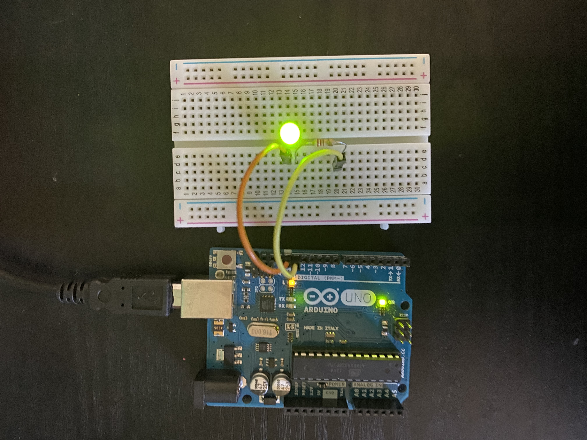
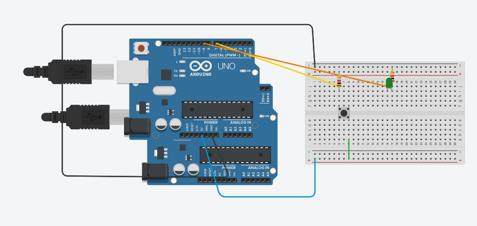

# BasicArduino
I'm going to learn how to use an Arduino, and make awesome things with it!


## TableofContents
* [TableOfContents](#TableOfContents)
* [HelloArduino](#HelloArduino)
* [FiniteLED](#FiniteLED)
* [ButtonActivatedLED](#ButtonActivatedLED)

## HelloArduino

### Description & Code

For this assignment we had to get our arduino'a to blink and to say "hello world". 

```
/*
  Blink

  Turns an LED on for half a second, then off for half a second, repeatedly.
  
  modified 8 May 2014  by Scott Fitzgerald
 
  http://www.arduino.cc/en/Tutorial/Blink
*/


// the setup function runs once when you press reset or power the board
void setup() {
  // initialize digital pin 13 as an output.
  pinMode(13, OUTPUT);
  Serial.begin(9600); // This turns on my Serial Monitor
  Serial.println("Hello World!");
}

// the loop function runs over and over again forever
void loop() {
  digitalWrite(13, HIGH);           // turn the LED on (HIGH is the voltage level)
  Serial.println("Blink!");
  delay(250);                       // wait for a second
  digitalWrite(13, LOW);            // turn the LED off by making the voltage LOW
  delay(250);                       // wait for a second
}

```

### Evidence
[Here is my code on Arduino Create](https://create.arduino.cc/editor/sgupta70/65b4b6c6-7e0c-4e37-bb7e-4be5436a4f95/preview)

### Image or Wiring



### Reflection

This was kind of tricky for me, we were doing a lot of things that I wasn't used too. It took me a while to figure everything out, but I was eventually able to get it to work. The wiring and code was quite simple.


## FiniteLED

### Description & Code

For this assignment we had to get our LED light to blink 5 times and then stop. 

```
int ledPin = 13;
int blinkTime = 500;
bool eyesStinging=true;


void setup()
{
  pinMode(ledPin, OUTPUT);
if(eyesStinging)                         //Only blink if it's absolutely necessary
  blinkyBlinky(5, blinkTime); // 5 is number of blinks, blinkTime is the milliseconds in each state from above: int blinkTime = 500;
}

void loop()
{


  //
}

void blinkyBlinky(int repeats, int time)
{
  for (int i = 0; i < repeats; i++)
  {
    digitalWrite(ledPin, HIGH);
    delay(time);
    digitalWrite(ledPin, LOW);
    delay(time);
  }
}

```

### Evidence
[Here is my code on Arduino Create](https://create.arduino.cc/editor/sgupta70/db18afe5-231b-4318-874c-7bb4662af893/preview)

### Image or Wiring


### Reflection

This was kind of tricky for me, we were doing a lot of things that I wasn't used too. It took me a while to figure everything out, but I was eventually able to get it to work. The wiring and code was quite simple.


## ButtonActivatedLED

### Description & Code

For this assignment we had to turn on our LED light using a button. 

```
/* sketch 1 
turn on a LED when the button is pressed
turn it off when the button is not pressed (or released)
*/
int pinButton = 7; //the pin where we connect the button
int LED = 9; //the pin we connect the LED

void setup() {
  pinMode(pinButton, INPUT); //set the button pin as INPUT
  pinMode(LED, OUTPUT); //set the LED pin as OUTPUT
}

void loop() {
  int stateButton = digitalRead(pinButton); //read the state of the button
  if(stateButton == 1) { //if is pressed
     digitalWrite(LED, HIGH); //write 1 or HIGH to led pin
  } else { //if not pressed
     digitalWrite(LED, LOW);  //write 0 or low to led pin
  }
}

```

### Evidence
[Here is my code on Arduino Create](https://create.arduino.cc/editor/sgupta70/618a3947-0f3f-4769-8baa-bce7e87d906c/preview)

### Image or Wiring



### Reflection

This had a lot more wiring and more coding, we also had to figure out a way to only turn on the light with a button. It wasn't super hard and I got the hang of it pretty quickly. 


